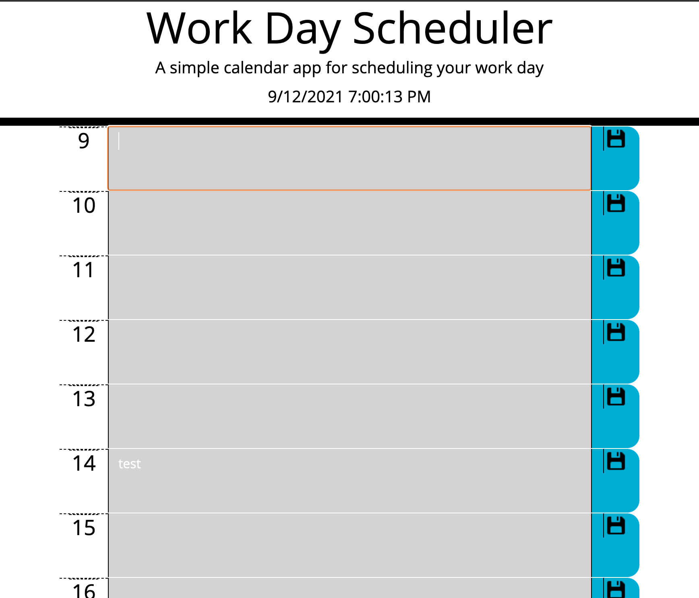

# WorkDayScheduler

## Description
Task Scheduler Web App where users can write down tasks per hour and quickly see past, present, and future events.

## User Guide
Type in the text field next to the time of your task. Click the save icon to 

## Built With
- HTML
- CSS, BootStrap
- JavaScript, JQuery, DayJS

## Live on GitPages
Live on [git Pages](https://dustinturp.github.io/WorkDayScheduler/)

## Preview

## Future Improvements
- clear tasks in memory with a button
- replace JQuery with standard JS
- Option to change time to 24 hour format